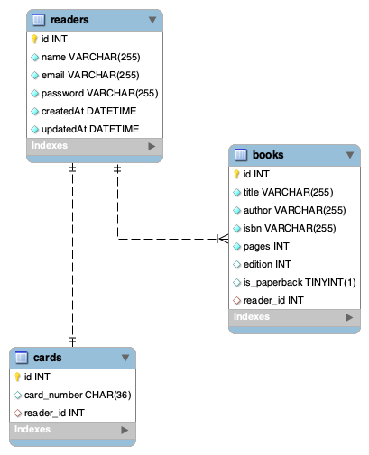

# Demo ORM Library

## SQL

```sql
DROP DATABASE IF EXISTS library_db;
CREATE DATABASE library_db;
```

---



---

### Validations

## Routes

For `Reader`, no nulls, and validate ✉️.

### Reader

- GET /api/readers/:id - get reader by id
- POST /api/readers - create reader
- DELETE /api/readers/:id - delete reader by id

### Card

- GET /api/cards/:id - get card by id
